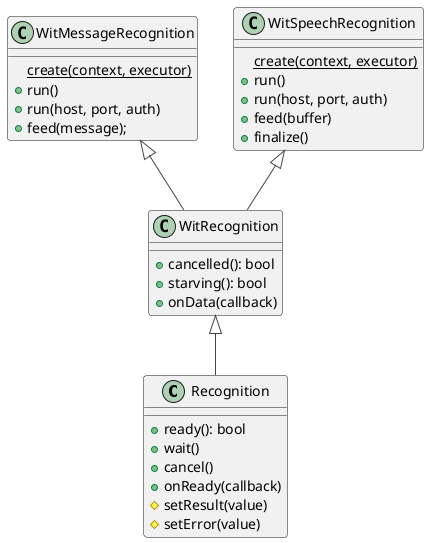

# Class diagrams

```plantuml
@startuml
!theme vibrant

class Recognition {
    +ready(): bool
    +wait()
    +cancel()
    +onReady(callback)
    #setResult(value)
    #setError(value)
}

class WitRecognition {
    +cancelled(): bool
    +starving(): bool
    +onData(callback)
}

class WitMessageRecognition {
    {static} create(context, executor)
    +run()
    +run(host, port, auth)
    +feed(message);
}

class WitSpeechRecognition {
    {static} create(context, executor)
    +run()
    +run(host, port, auth)
    +feed(buffer)
    +finalize()
}

WitRecognition <|-- Recognition
WitMessageRecognition <|-- WitRecognition
WitSpeechRecognition <|-- WitRecognition

@enduml
```