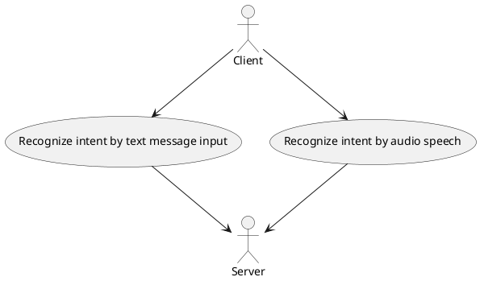
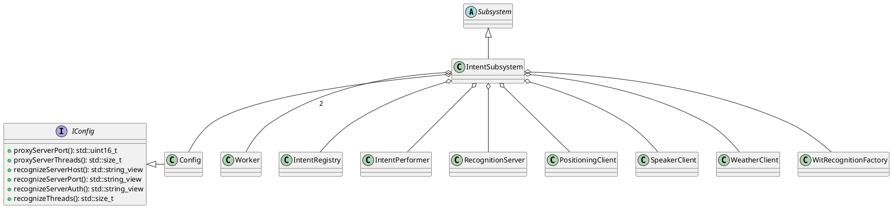
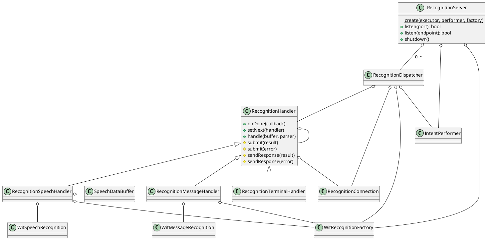
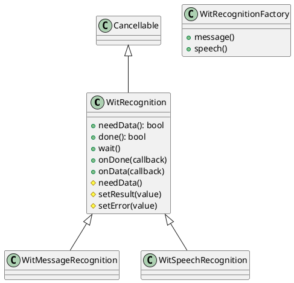
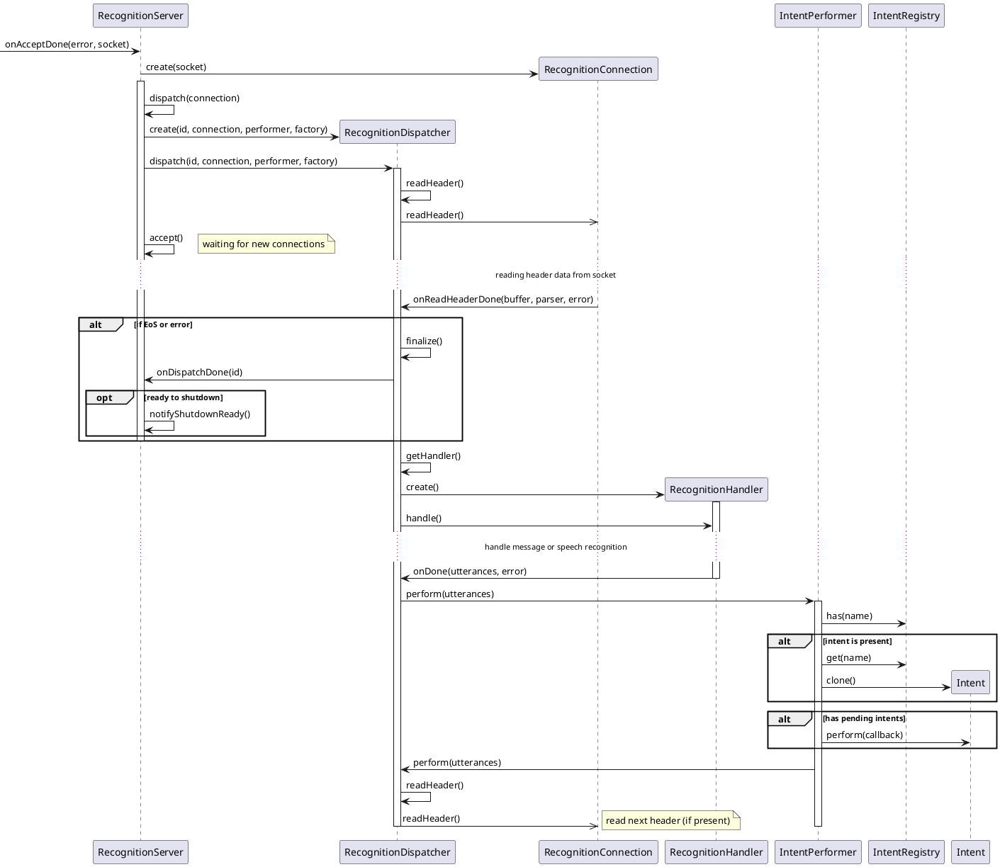
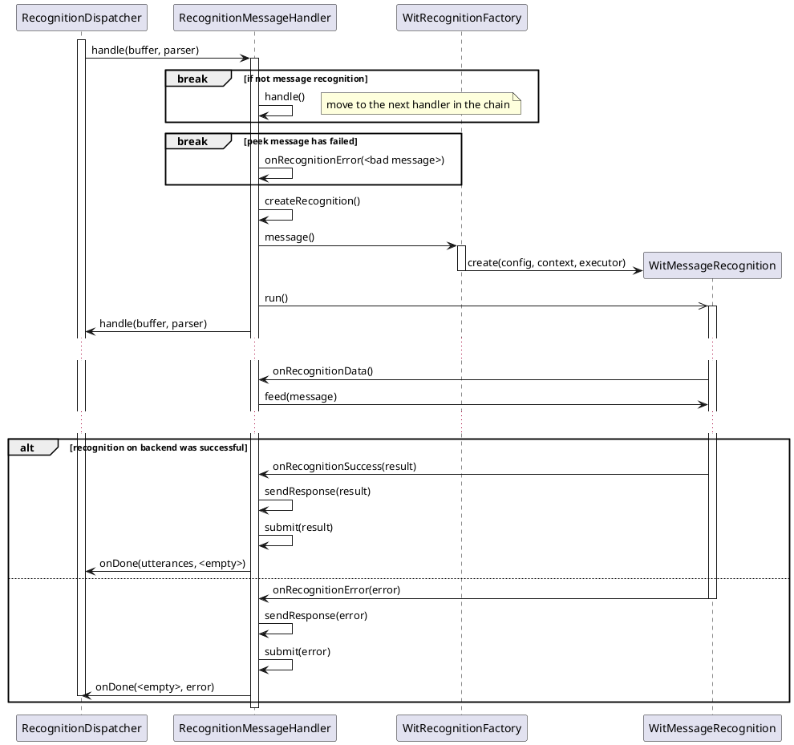
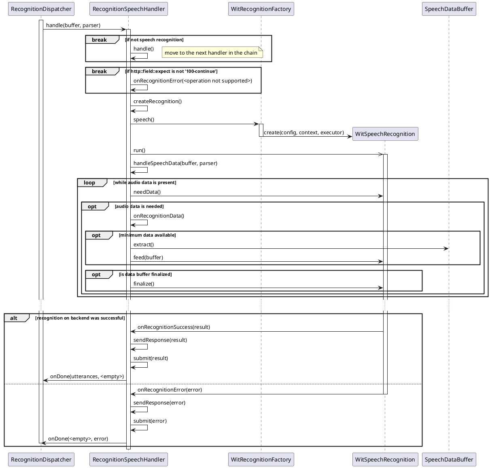
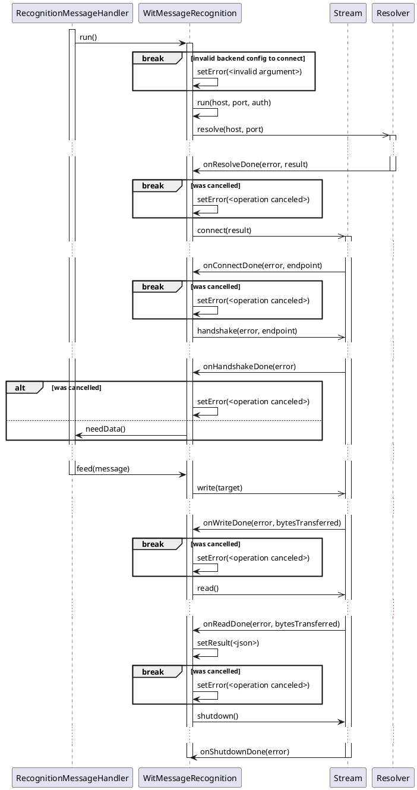
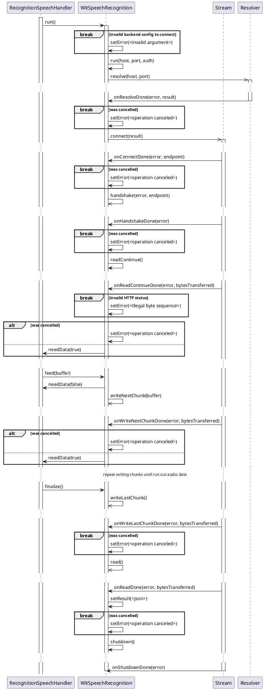

# Introduction

Intent component is a main component of executor service. This component includes server, recognition handlers and backend clients.
Additionally multiple known intents  are present. Each of the known intents represents some actions needed to be done upon client request.

# Purpose

The purpose is recognizing known intent by text message or audio speech and perform this intent upon client request.

# Use Cases

* Recognize intent

# Component Structure

## Software Units

| Name                       | Description                                                         |
|----------------------------|---------------------------------------------------------------------|
| Intent                     | Represents base class for intents                                   |
| IntentParser               | Represents base class for intents parser                            |
| IntentPerformer            | The performer to accomplish intent                                  |
| IntentRegistry             | The registry to store all currently supported intents               |
| IntentSubsystem            | The subsystem to handle lifetime of service software units          |
| PositioningClient          | The client to provide current location                              |
| RecognitionConnection      | The wrapper to handle operations upon client connection             |
| RecognitionDispatcher      | The dispatcher to handle recognition sent to backend                |
| RecognitionHandler         | Represents base class for recognition handler                       |
| RecognitionMessageHandler  | The message recognition handler to handle particular client request |
| RecognitionSpeechHandler   | The speech recognition handler to handle particular client request  |
| RecognitionTerminalHandler | The terminal (empty) handler                                        |
| RecognitionServer          | The server to accept client connections                             |
| SpeechDataBuffer           | The data buffer to receive and store client audio data              |
| WitIntentParser            | The wit.ai intent parser                                            |
| WitMessageRecognition      | The wit.ai message recognition request to backend                   |
| WitSpeechRecognition       | The wit.ai speech recognition request to backend                    |
| WitRecognition             | Represents base class for recognition request to backend            |
| WitRecognitionFactory      | The factory to create recognition request to backend                |

## Class Diagrams

* Subsystem

* Recognition server

* The wit.ai backend classes

## Sequence Diagram

* Dispatch client recognition requests

* Handle client message recognition requests

* Handle client speech recognition requests

* Handle message recognition request to backend

* Handle speech recognition request to backend

