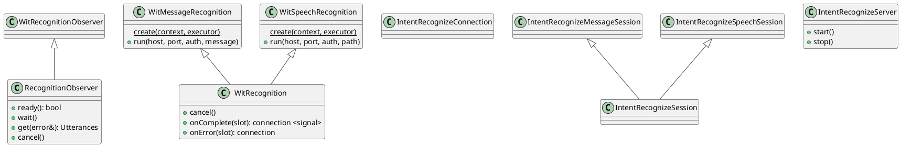

# Class diagrams

```plantuml
@startuml
!theme vibrant

class RecognitionObserver {
    +ready(): bool
    +wait()
    +get(error&): Utterances
    +cancel()
}

WitRecognitionObserver <|-- RecognitionObserver

class WitMessageRecognition {
    {static} create(context, executor)
    +run(host, port, auth, message)
}

class WitSpeechRecognition {
    {static} create(context, executor)
    +run(host, port, auth, path)
}

class WitRecognition {
    +cancel()
    +onComplete(slot): connection <signal>
    +onError(slot): connection
}

WitMessageRecognition <|-- WitRecognition
WitSpeechRecognition <|-- WitRecognition

class IntentRecognizeConnection
class IntentRecognizeSession

IntentRecognizeMessageSession <|-- IntentRecognizeSession
IntentRecognizeSpeechSession <|-- IntentRecognizeSession

class IntentRecognizeServer {
    +start()
    +stop()
}

@enduml
```