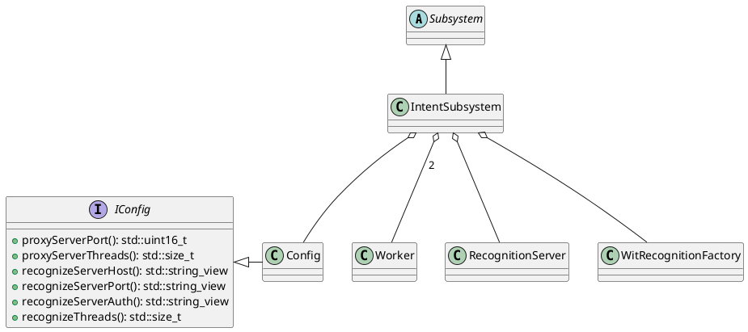
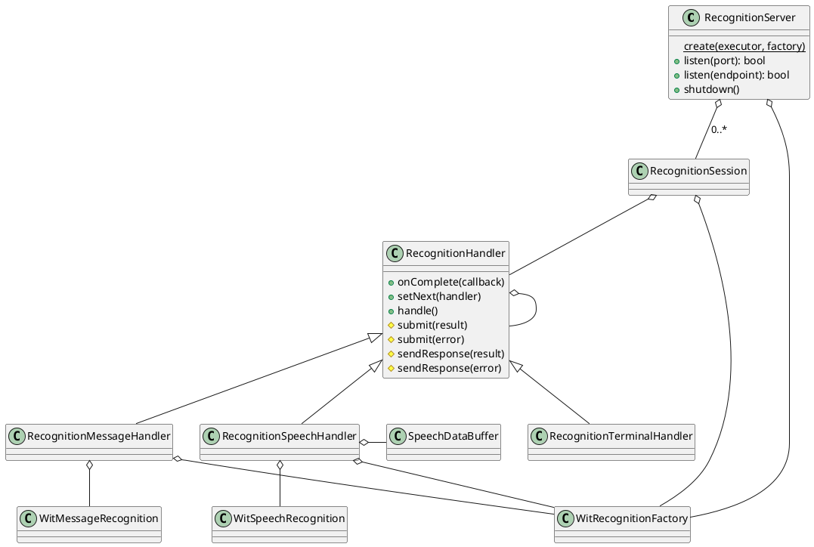
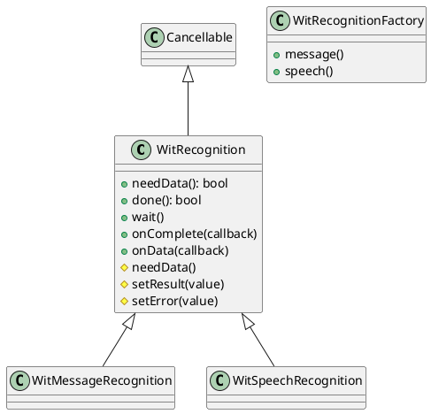
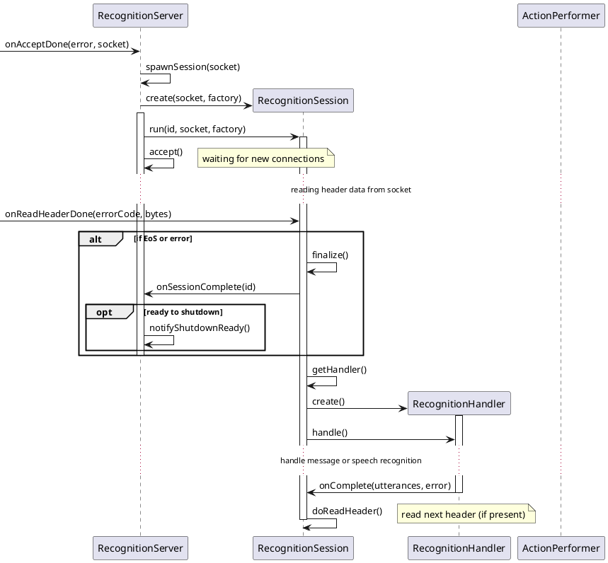
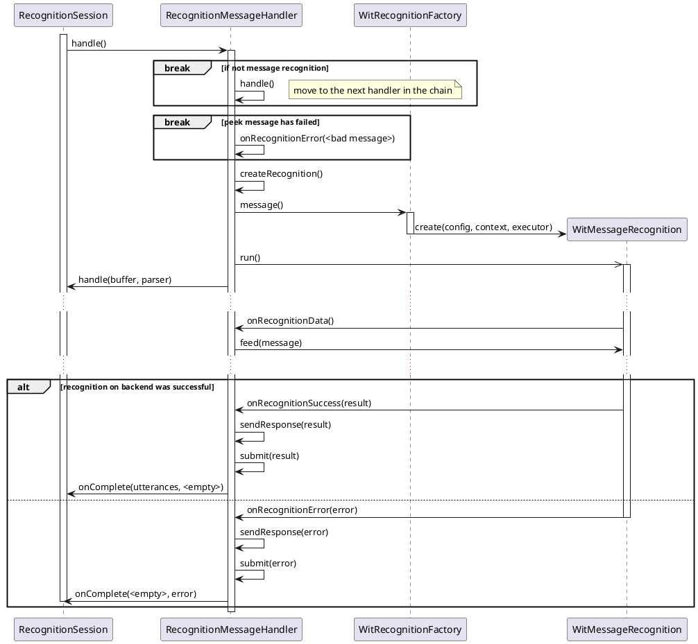
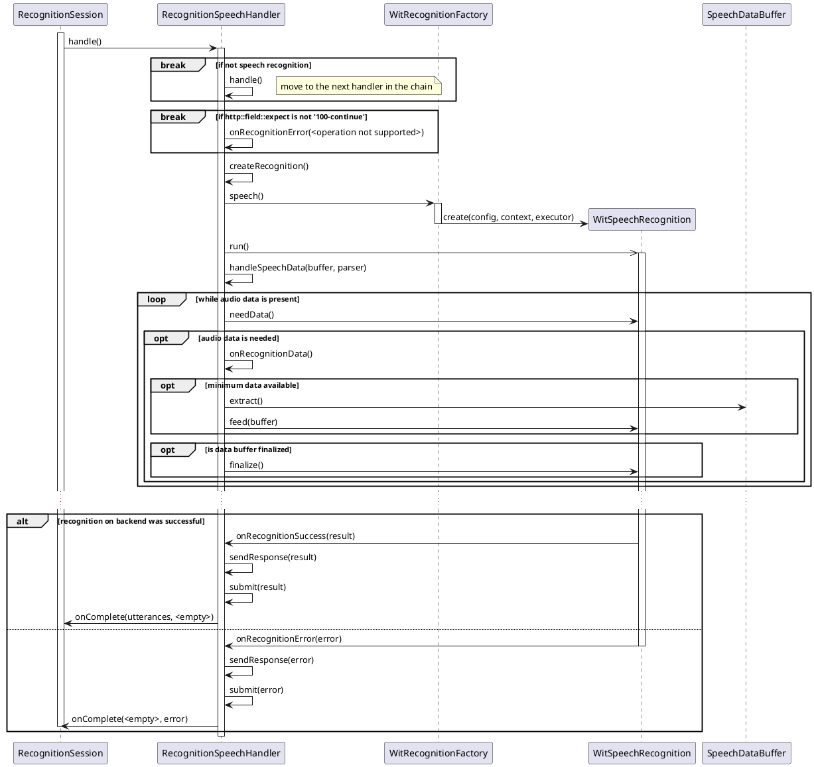

# Introduction

Intent component is a main component of the `Rintento` service. This component includes server, recognition handlers and
backend clients.

# Purpose

The purpose is recognizing known intent by text message or audio speech and perform action upon client request.

# Use Cases

* Intent recognizing

# Component Structure

## Software Units

| Name                       | Description                                                         |
|----------------------------|---------------------------------------------------------------------|
| RecognitionSession         | The dispatcher to handle recognition sent to backend                |
| RecognitionHandler         | Represents base class for recognition handler                       |
| RecognitionMessageHandler  | The message recognition handler to handle particular client request |
| RecognitionSpeechHandler   | The speech recognition handler to handle particular client request  |
| RecognitionTerminalHandler | The terminal (empty) handler                                        |
| RecognitionServer          | The server to accept client connections                             |
| SpeechDataBuffer           | The data buffer to receive and store client audio data              |
| WitIntentParser            | The wit.ai intent parser                                            |
| WitMessageRecognition      | The wit.ai message recognition request to backend                   |
| WitSpeechRecognition       | The wit.ai speech recognition request to backend                    |
| WitRecognition             | Represents base class for recognition request to backend            |
| WitRecognitionFactory      | The factory to create recognition request to backend                |
| IntentSubsystem            | The subsystem to handle lifetime of service software units          |

## Class Diagrams

* Subsystem

* Recognition server

* The wit.ai backend classes

## Sequence Diagram

* Handle client recognition requests

* Handle message recognition request

* Handle client speech recognition request

* Handle message recognition request to backend

* Handle speech recognition request to backend

